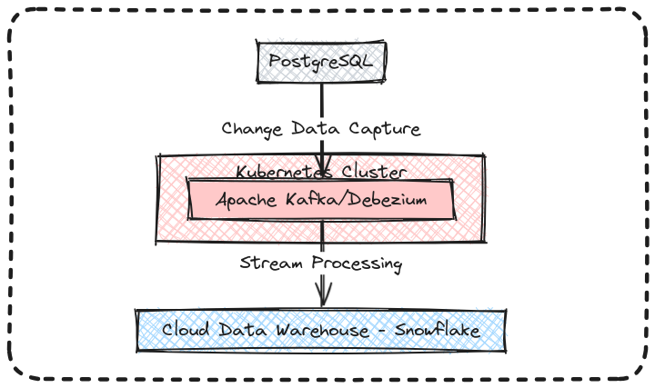

# StreamFlake: Real-Time CDC Pipeline with Kafka and Snowflake

## Building a Real-Time CDC Pipeline with Kafka and Snowflake

This document outlines a three-part series on building a real-time CDC (Change Data Capture) pipeline using Kafka and Debezium to stream changes from a Postgres database to a Snowflake lake house.

## Architecture



## Part 1: Installing and Deploying Confluent Kafka on Kubernetes

### Requirements

* Kubectl and Minikube with 2 CPUs and 4GB memory
* Linux Ubuntu 22.04 (or similar)
* Kubectl v1.29.3 (or later)
* Minikube v1.32.0 (or later)

### Section 1: Installing kubectl

**Download and install kubectl for your operating system:**

https://kubernetes.io/docs/tasks/tools/install-kubectl-linux/

1. Download kubectl:

```
curl -LO "https://dl.k8s.io/release/$(curl -L -s https://dl.k8s.io/release/stable.txt)/bin/linux/amd64/kubectl"
```

2. Install kubectl:

```
sudo install -o root -g root -m 0755 kubectl /usr/local/bin/kubectl
```

3. Check kubectl version:

```
kubectl version --client --output=yaml
```

### Section 2: Installing Minikube

**Install and start Minikube:**

https://minikube.sigs.k8s.io/docs/start/

1. Download Minikube:

```
curl -LO https://storage.googleapis.com/minikube/releases/latest/minikube-linux-amd64
```

2. Install Minikube:

```
sudo install minikube-linux-amd64 /usr/local/bin/minikube && rm minikube-linux-amd64
```

3. Check Minikube version:

```
minikube version
```

4. Start Minikube:

```
minikube start
```

**For a development/local environment with minimal CPU/memory configuration:**

```
minikube start --cpus 2 --memory 4096
```

### Section 3: Deploying Confluent Kafka

**Deploy Confluent Kafka on Kubernetes using the provided Helm chart:**

https://github.com/confluentinc/confluent-kubernetes-examples

1. Create a Confluent namespace:

```
kubectl create namespace confluent
```

2. Set Confluent as your current context:

```
kubectl config get-contexts
kubectl config set-context --current --namespace confluent
```

3. Set up the Helm Chart:

```
helm repo add confluentinc https://packages.confluent.io/helm
```

4. Install Confluent Operator for Kubernetes using Helm:

```
helm upgrade --install confluent-operator confluentinc/confluent-for-kubernetes --namespace confluent
```

5. Deploy Confluent Platform with the provided configuration:

```
kubectl apply -f ./helm/confluent-platform.yaml
```

**For a development/local environment with minimal configuration:**

```
kubectl apply -f ./helm/confluent-platform-dev.yaml
```

6. Check that the Confluent For Kubernetes pod comes up and is running:

```
kubectl get pods
```

7. Check that all Confluent Platform resources are deployed:

```
kubectl get confluent
```

8. Access the Control Center on your web browser:

* Get Kubernetes IP:

```
minikube ip
```

* Get exposed port:

```
kubectl describe service -n confluent | grep -i nodeport
```

* Access Control Center on `ip:port`

**Alternatively, forward desired pod ports to your local machine:**

```
kubectl port-forward schemaregistry-0 8081:8081
kubectl port-forward controlcenter-0 9021:9021
kubectl port-forward connect-0 8083:8083
```

### Troubleshooting

* Use `kubectl get po -n confluent` to check pods.
* Use `kubectl describe pod connect-0` for pod-specific information.
* Use `kubectl logs connect-0 | grep -i error` to view error messages.

### Cleanup

* Delete Kubernetes resources:

```
kubectl delete -f ./helm/confluent-platform.yaml
```

* Alternatively, for the development/local environment:

```
kubectl delete -f ./helm/confluent-platform-dev.yaml
```

* Check if ports are being forwarded:

```
ps -aux | grep kubectl
```

* Kill process:

```
pkill kubectl
```

* Uninstall Confluent Operator:

```
helm uninstall confluent-operator
```

* Stop Minikube (if necessary):

```
minikube stop
```

* Delete Minikube (WARNING: this will destroy everything deployed):

```
minikube delete
```

This is the first part of a three-part series. Stay tuned for the next installments!